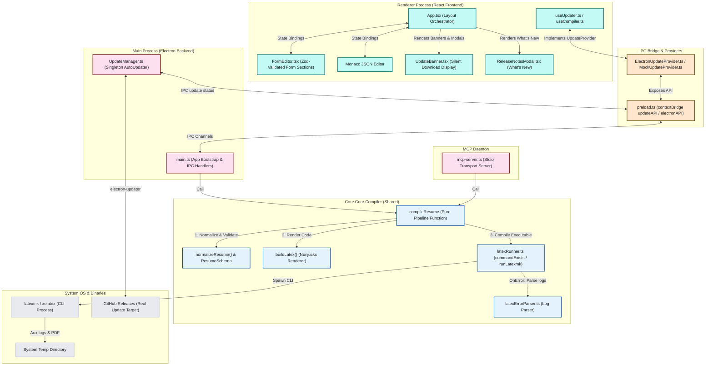

# Project Architecture & Structure Graph

This document details the system design, file structure, and data flows of the **Resume Generator** application.

---

## 1. System Overview

The **Resume Generator** is an Electron desktop application and AI backend built with **React**, **Vite**, **TypeScript**, and **Tailwind CSS**. 

It takes structured resume data (edited via a dynamic form UI or raw JSON), normalizes it, validates it against a strict Zod schema, renders it into LaTeX using a **Nunjucks** templating environment, and compiles it via `latexmk` / `xelatex` into a high-quality PDF.

The core compilation and validation layers are decoupled from Electron into a shared pipeline, enabling a built-in **Model Context Protocol (MCP) Server** to share the exact same compilation workflow with external AI agents.

### Technology Stack
- **Desktop Shell**: Electron 41.x, Vite, Context-Bridge Preload Script.
- **Frontend Framework**: React 19.x & TypeScript, styled with Tailwind CSS.
- **Code/JSON Editor**: Monaco Editor (`@monaco-editor/react`).
- **Drag-and-Drop Reordering**: `@dnd-kit/core` & `@dnd-kit/sortable`.
- **Schema Validation**: Zod (`zod`).
- **Template Engine**: Nunjucks (adapted with custom delimiters for LaTeX compatibility).
- **AI Integration**: Model Context Protocol (MCP) SDK (`@modelcontextprotocol/sdk`).
- **Auto-Updates**: `electron-updater` (packaged and metadata-aligned with GitHub Releases).
- **PDF Compilation Backend**: Local LaTeX distribution (requires `xelatex` and `latexmk`).

---

## 2. Core Architecture & Data Flow

The application is divided into three primary layers:
1. **Renderer Interface (React Frontend)**: Manages UI panes, state hooks, and client update notifications.
2. **Main Core Pipeline (Shared Services)**: Contains the pure compilation/validation pipeline, LaTeX builders, and runners.
3. **Infrastructure Hosts (Electron & MCP)**: Exposes the core pipeline to the desktop app and AI IDE agents.



---

## 3. Directory Structure Details

```
resume-generator/
├── .agents/                        # Project-scoped AI configurations (MCP config)
├── .github/workflows/              # CI/CD Workflows
│   └── release.yml                 # Builds & publishes Electron App + latest.yml on git tag push
├── templates/                      # LaTeX templates with Nunjucks tags
│   └── classic.tex                 # Default resume template
│
└── electron-app/                   # Electron Desktop codebase
    ├── electron/                   # Electron Main & Preload scripts
    │   ├── main.ts                 # Main process: registers IPC, binds compileResume
    │   ├── preload.ts              # Bridge: exposes context-isolated electronAPI/updateAPI
    │   └── UpdateManager.ts        # Singleton wrapper for electron-updater configurations
    │
    ├── src/                        # Renderer process (React Frontend)
    │   ├── main.tsx                # Frontend entry point
    │   ├── App.tsx                 # Root orchestrator layout (wires layout panes & modals)
    │   ├── mcp-server.ts           # Model Context Protocol stdio daemon
    │   │
    │   ├── components/             # React UI components
    │   │   ├── FormEditor.tsx      # Orchestrates form UI; validates inputs with Zod
    │   │   ├── SetupWizard.tsx     # Wizard helper verifying latexmk/xelatex status
    │   │   ├── UpdateBanner.tsx    # Displays silent update progress & restart prompts
    │   │   ├── ReleaseNotesModal.tsx # "What's New" popup shown after restart installs
    │   │   └── Settings/           # Style presets panel components
    │   │
    │   ├── hooks/                  # Custom state hooks
    │   │   ├── useDocument.ts      # Handles local file load/saves
    │   │   ├── useCompiler.ts      # Triggers compilation and manages pdfUrl
    │   │   ├── useStyle.ts         # Coordinates margins, font-sizes, and section colors
    │   │   └── useUpdater.ts       # Hook driving auto-updates with 6-hour throttles
    │   │
    │   ├── layout/                 # Flex/Grid pane layouts
    │   │   ├── AppLayout.tsx       # Core shell boundary
    │   │   ├── EditorPane.tsx      # Sidebar holding editor forms & Monaco JSON
    │   │   └── PreviewPane.tsx     # Holds PDF iframe viewer
    │   │
    │   ├── lib/                    # Low-level core libraries
    │   │   ├── builder.ts          # Nunjucks compiler & Jinja python polyfills
    │   │   ├── escaper.ts          # LaTeX reserved escaper & term wrapper
    │   │   ├── latexRunner.ts      # Low-level latexmk command runner (Node spawn)
    │   │   └── latexErrorParser.ts # Decodes raw logs to extract line-level issues
    │   │
    │   ├── models/
    │   │   └── resume.ts           # Zod schema definitions (Email, Phone validation)
    │   │
    │   ├── providers/              # IPC update provider implementations
    │   │   ├── ElectronUpdateProvider.ts # Connects to live main process UpdateManager
    │   │   └── MockUpdateProvider.ts     # Mock update simulator for sandbox testing
    │   │
    │   ├── services/               # Shared high-level core services
    │   │   ├── ResumeCompiler.ts   # Core compileResume() pipeline function
    │   │   ├── ResumeNormalizer.ts # Normalizes missing properties in raw input JSON
    │   │   └── ElectronService.ts  # Renderer IPC wrapper
    │   │
    │   ├── types/                  # TS Type definitions
    │   │   ├── compiler.ts         # CompileResult discriminated unions
    │   │   └── update.ts           # Auto-updater interfaces
    │   │
    │   ├── vite.config.ts          # Vite build config (includes external Rollup rules)
    │   └── package.json            # Node project configuration
```

---

## 4. Key Components Explained

### 4.1 Shared `compileResume` Pipeline
*   **Decoupled Pure Function**: Implemented in `ResumeCompiler.ts`, `compileResume(...)` accepts raw resume data and compilation configurations. It is entirely isolated from Electron UI boundaries.
*   **Validation Discriminated Union**: Returns a strongly typed `CompileResult` union (`success: true` or `success: false` with categories: `validation`, `compilation`, and `cancelled`). This eliminates impossible typing states in callers.
*   **Resource Management**: Spawns jobs inside unique timestamped subdirectories inside the OS temp directory. All compilation files (`.tex`, `.aux`, `.log`) are cleared inside a `finally` block to protect storage, keeping only the final PDF on success, or removing the entire folder on failure.

### 4.2 Model Context Protocol (MCP) Server
*   **Stdio Transport**: Listens on stdin/stdout to connect with AI IDE interfaces.
*   **Shared Operations**: Leverages the identical `compileResume` pipeline. When `generate_resume_pdf` is called, it normalizes and validates inputs, compiles the LaTeX PDF, writes the file to the user's requested output path, and cleanly cleans up.
*   **Error Parsing**: Passes compilation log trails to `latexErrorParser.ts` to return precise compilation error locations to the AI agent, allowing the AI to auto-fix and re-run compilation.

### 4.3 Electron Auto-Updater Lifecycle
*   **UpdateManager (Main Process)**: Singleton wrapper around `electron-updater`'s `autoUpdater` with `autoDownload = true` (silent download in background).
*   **6-Hour Throttle**: Checked by `useUpdater.ts` using a `localStorage` timestamp to prevent rate-limiting requests on every app boot.
*   **State Machine**: Runs: `Idle` $\rightarrow$ `Checking` $\rightarrow$ `Available` $\rightarrow$ `Downloading` $\rightarrow$ `ReadyToInstall` $\rightarrow$ `Installing` $\rightarrow$ `Error`.
*   **What's New Prompt**: Banner click triggers cache of update information into `localStorage` before restarting. On reboot, `App.tsx` reads version info, renders a release notes modal, and clears the cache.
